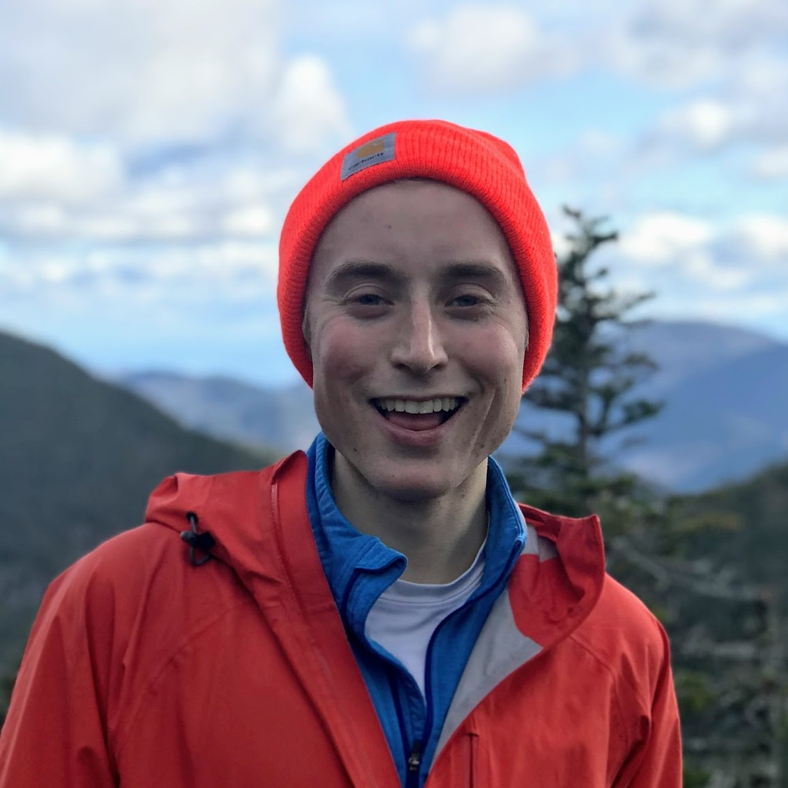

@def title = "tclements.github.io"
@def tags = ["syntax", "code"]

# Welcome

This is a place to share my research and quick posts on my wanderings using the Julia language for seismology, HPC, GPU & cloud computing, and machine learning.

## About Me 

~~~

  

    
    

    I'm a 5th year PhD student in <a href="https://eps.harvard.edu/">seismology at Harvard University</a> in <a href="https://quake.fas.harvard.edu/">Marine Denolle's group</a>. My research focuses on using the Earth's ambient wavefield to monitor changes in soil moisture and groundwater levels. I have interests in environmental seismology, numerical methods, machine learning and cloud computing. 
    

    

    I am Chair of <a href="https://projects.iq.harvard.edu/hgwise/hgwise-guys">HGWISE Guys</a> at Harvard. HGWISE Guys is an extension of <a href="https://projects.iq.harvard.edu/hgwise">HGWISE</a> (Harvard Graduate Women in Science and Engineering), where all Harvard graduate students, regardless of their gender, can engage in issues of gender, bias and harassment in science.
    

    

      
  

~~~

#### Contact

Email: thclements [at] g {dot} harvard (dot) edu

Address: Geomuseum Building 200B, 20 Oxford Street, Cambridge, MA 02138

Github: [tclements](https://github.com/tclements)